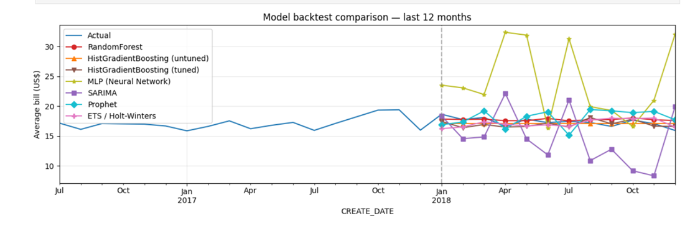

# TPC Repair Billing — Time-Series Forecast

**Predicting monthly average repair bills using 8 forecasting models on real eMARS TPC data.**

  
*(Add a screenshot of your final forecast plot here)*

## 📋 Project Overview
- Built a clean monthly time-series from 1.5M+ repair line items (2015–2018).
- Converted all currencies to USD using transaction-specific exchange rates.
- Benchmarked **8 models** (ML + classical): RandomForest, HistGradientBoosting, SARIMA, Prophet, ETS, etc.
- Selected winner based on MAE / MAPE on a hold-out set.
- Produced a 12-month forward forecast.

## 🛠️ Key Skills Demonstrated
- Time-series feature engineering & lag creation
- Machine Learning (sklearn) vs Classical forecasting
- Model evaluation & leaderboard comparison
- Data cleaning at scale (large CSV handling, currency normalization)
- Python (pandas, matplotlib, scikit-learn, statsmodels)

## 📊 Results
- Best model: **[e.g. HistGradientBoosting]** with MAE = $X.XX
- Forecast shows stable/flat trend in average bill amount
- Recursive forecasting insights + limitations of tree-based models

**[View Full Notebook →](https://github.com/MChu2019/tpc-repair-forecast/blob/main/Repair_Cost_Recovery_Forecast.ipynb)**  

## 🧩 What I Learned
- Tree models can't extrapolate trends beyond training data
- Importance of proper train/test split in time series
- Value of comparing multiple forecasting paradigms on the same dataset
